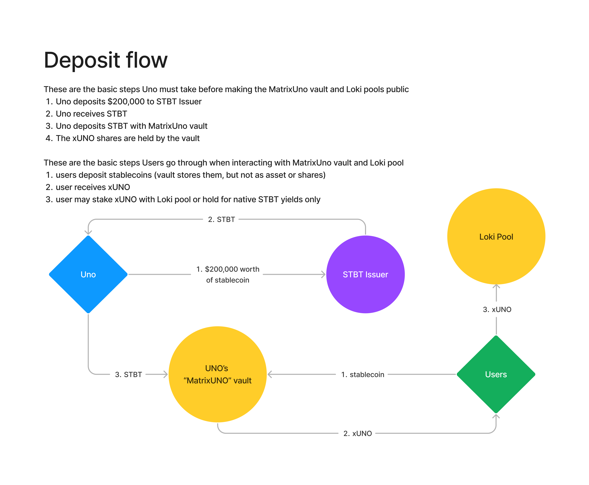
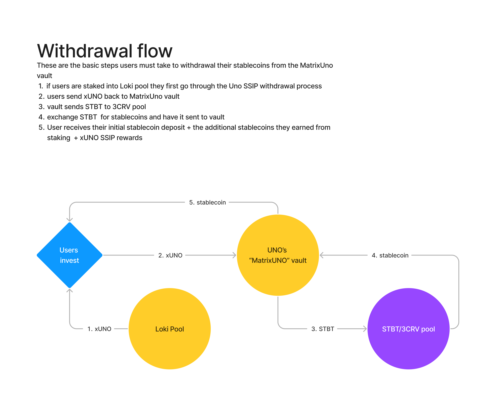

## Uno Re Real World Assets

These are designs for new UNO RE staking pools that allow users to invest in real world assets while investing into UNO's single sided insurance pools (SSIP)

- [OpenZeppelin ERC4626](https://github.com/OpenZeppelin/openzeppelin-contracts/blob/master/contracts/token/ERC20/extensions/ERC4626.sol)

## Matrix - Uno

### Overview

The MatrixUno integration involves using a customized ERC-4626 as well as interacting with Curve finance's Vyper smart contracts.

Users may stake DAI, USDC, or USDT into the `MatrixUno` vault to receive `xUNO`. This `shares` token represents your portion of an `STBT` investment that in turn represents a portion of a US treasury bills!

By staking to the vault you earn these native `STBT` yields proportional to the amount you've staked. Rewards are distributed to users automatically whenever they call `stake`, `unstake` or `claim`. The formula for calculating a user's rewards at any time is as follows:

**where**:

- r = rewards to send to the user
- i = initial amount of STBT in the vault
- c = the current week index, starting from the contract's deployment
- u/userStake = total amount of stablecoins the user staked
- l = the lastClaim week or last time the user claimed their rewards
- Ia = array of rewards the vault earned each week
- Ib = array of underlying vault STBT balances each week
- x = an integer starting at 0

The deposit flow is pretty straightforward and follows the steps outlined in this diagram

The withdrawal flow is a little more complex involving an extra step to convert STBT into stablecoins before being sent to the user

### Begin testing Matrix - Uno Re flow

The first thing you must do to test the MatrixUno flow is put your mainnet RPC_URL in the .env file like shown in the `.env.example`

    `FORKING_URL=https://eth-mainnet.g.alchemy.com/v2/<YOUR_KEY>`

Now we can start a mainnet fork on your local hardhat blockchain

    `yarn hardhat node --tags matrixUno`

After the fork has started running, and your vault contract has been deployed, you're ready to run the tests

    `yarn hardhat test --network localhost`

### Maple UNO

The `Hades` pool interacts with the Maple Finance RWA pools

- [M11 Credit - USDC](https://app.maple.finance/#/v2/lend/pool/0xd3cd37a7299b963bbc69592e5ba933388f70dc88)
- [Maple Pool GitHub](https://github.com/maple-labs/pool-v2)
- [Maple lending pools](https://app.maple.finance/#/v2/lend)

### Matrixdock UNO

The `Loki` pool interacts with the STBT/3CRV Curve pool

- [Matrixdock GitHub](https://github.com/Matrixdock-STBT/STBT-contracts)
- [STBT/3CRV](https://curve.fi/#/ethereum/pools/factory-v2-279/deposit)
- [STBT/3CRV pool proxy](https://etherscan.io/address/0x892D701d94a43bDBCB5eA28891DaCA2Fa22A690b#code)
- [STBT/3CRV pool implementation](https://etherscan.io/address/0x55aa9bf126bcabf0bdc17fa9e39ec9239e1ce7a9#code)
- [STBT/3CRV LP token](https://etherscan.io/token/0x892d701d94a43bdbcb5ea28891daca2fa22a690b?a=0x4b6911e1ae9519640d417ace509b9928d2f8377b)
- [Curve Gauge Proxy](https://etherscan.io/address/0x4b6911e1ae9519640d417ace509b9928d2f8377b#code)
- [Curve Gauge Implementation](https://etherscan.io/address/0x5ae854b098727a9f1603a1e21c50d52dc834d846#code)
- [3CRV token etherscan](https://etherscan.io/token/0x6c3f90f043a72fa612cbac8115ee7e52bde6e490)
- [Curve medium guide](https://betterprogramming.pub/how-to-integrate-the-curve-fi-protocol-into-your-defi-protocol-e1d4c43f716d)

### Current Developer Quickstart

`yarn hardhat node --tags matrixUno`

`yarn hardhat test --network localhost`
