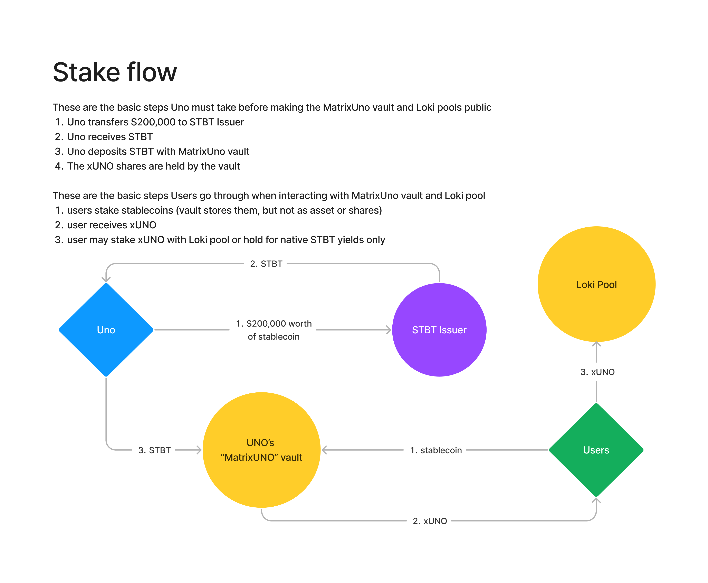
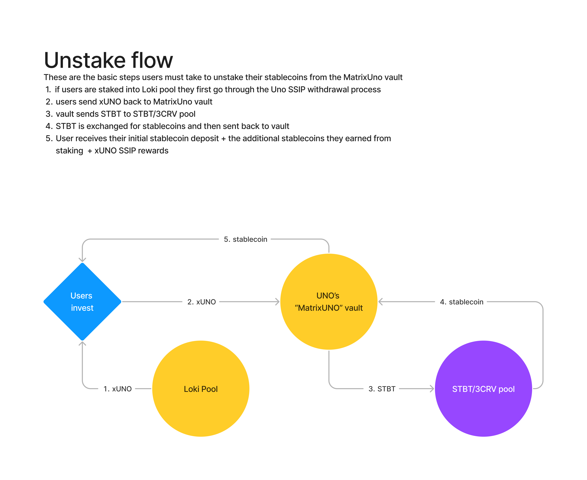

# Uno Re Real World Assets

These are designs for new UNO RE staking pools that allow users to invest in real world assets while investing into UNO's single sided insurance pools (SSIP)

- [OpenZeppelin ERC4626](https://github.com/OpenZeppelin/openzeppelin-contracts/blob/master/contracts/token/ERC20/extensions/ERC4626.sol)

## Matrix - Uno

This vault set up involves MatrixPort's STBT token, this token is pegged to $1 and earns the holders yield from US Treasury Bills. Users may hold the shares token, **xUNO**, for these yields alone, or they may also stake into an Uno Re SSIP for additional yield!

### Overview

The MatrixUno integration involves using a customized ERC-4626 as well as interacting with Curve finance's Vyper smart contracts.

The modifications to the vault logic involves:

1. `deposit()` and `withdraw()` have conditional statements to see if the caller is Uno Re's EOA that has been whitelisted by Matrixdock; if the caller is Uno, an additional variable called `unoDepositAmount` is incremented/decremented.

2. `stake()` and `unstake()` are two new functions that allow users to transfer stablecoins to the vault and in return receive xUNO.

3. `_swap()` handles exchanging STBT for stablecoins with the Curve STBT/3CRV pool

4. `_claim()`handles calculating the amount of rewards to send to each user

The Curve Finance STBT/3CRV pool is used to exchange STBT rewards into stablecoins before being transferred to the user. We call the function `exchange_underlying()` after approving the pool to take our STBT; the pool sends back stablecoins.

Users may stake DAI, USDC, or USDT into the `MatrixUno` vault to receive `xUNO`. This `shares` token represents your portion of an `STBT` investment that in turn represents a portion of a US treasury bills!

By staking to the vault you earn these native `STBT` yields proportional to the amount you've staked. Rewards are distributed to users automatically whenever they call `stake`, `unstake` or `claim`. The formula for calculating a user's rewards at any time is as follows:

**where**:

- r = rewards to send to the user
- c = the current reward period index, starting from the contract's deployment
- u = total amount of stablecoins the user staked
- l = the lastClaim reward period or last time the user claimed their rewards
- Ia = array of rewards the vault earned each reward period
- Ib = array of underlying vault STBT balances each reward period
- x = an integer starting at 0

The `stake()` flow is pretty straightforward and follows the steps outlined in this diagram

The `unstake()` flow is a little more complex involving an extra step to convert STBT into stablecoins before being sent to the user

### Testing

Currently there are two seperate test flows being used, one on an Ethereum Mainnet Fork, and the other on Ethereum's Goerli testnet

#### Begin testing Matrix - Uno Re flow

The first thing you must do to test the MatrixUno flow is put your mainnet RPC_URL in the .env file like shown in the `.env.example`

`FORKING_URL=https://eth-mainnet.g.alchemy.com/v2/<YOUR_KEY>`

#### Goerli testnet

NOTE: Contract addresses must be whitelisted by MatrixPort's STBT bot

NOTE: You will have to move the `.only` around to specificy which function calls to make in the goerli staging test (`performUpkeep` will mock sending 2,000 STBT to the vault as rewards)

Testing on Goerli has many key differences from how the forked tests are performed, however the overall flow remains the same.

`yarn hardhat deploy --network goerli --tags matrixUno`

This will whitelist your contract and also transfer 1 million mock USDC to it. After the contracts have been whitelisted to receieve STBT, you can run the `MatrixUno` staging tests.

`yarn hardhat test --network goerli`

If you see `false` console logged in the terminal, run the test command again. Sometimes the variables take longer than one block confirmation to get updated.

#### Example contracts deployed on Goerli:

- MatrixUno Vault [0x7118eef490b29fba7771669a7de804726d020f40](https://goerli.etherscan.io/address/0x7118eef490b29fba7771669a7de804726d020f40)

- Mock Curve Pool [0x1Ae0AA56D9307bC7b13a4d43996f68892DB42911](https://goerli.etherscan.io/address/0x1Ae0AA56D9307bC7b13a4d43996f68892DB42911)

### Current Developer Quickstart

`yarn hardhat node`

`yarn hardhat test --network localhost`

### External Resources

1. **MatrixPort's STBT** is an ERC-20 that earns yield from short-term US treasury bills
2. **Open Zeppelin ERC-4626** is their take on the vault standard EIP that introduces the `asset` and `shares` token structure
3. **ABDK Math Library** is a math library that allows for precise calculations using fractions, decimals, or percentages
4. **Chainalysis Sanctions List** is a contract that maintains a list of sanctioned addresses so that anyone can screen users before interacting with a function
5. **Curve Finance** is a DeFi protocol that allows users to swap tokens in a permisionless manner, specifically STBT for us

### Matrixdock UNO References

The `Loki` pool interacts with the STBT/3CRV Curve pool

- [Matrixdock GitHub](https://github.com/Matrixdock-STBT/STBT-contracts)
- [STBT/3CRV](https://curve.fi/#/ethereum/pools/factory-v2-279/deposit)
- [STBT/3CRV pool proxy](https://etherscan.io/address/0x892D701d94a43bDBCB5eA28891DaCA2Fa22A690b#code)
- [STBT/3CRV pool implementation](https://etherscan.io/address/0x55aa9bf126bcabf0bdc17fa9e39ec9239e1ce7a9#code)
- [STBT/3CRV LP token](https://etherscan.io/token/0x892d701d94a43bdbcb5ea28891daca2fa22a690b?a=0x4b6911e1ae9519640d417ace509b9928d2f8377b)
- [Curve Gauge Proxy](https://etherscan.io/address/0x4b6911e1ae9519640d417ace509b9928d2f8377b#code)
- [Curve Gauge Implementation](https://etherscan.io/address/0x5ae854b098727a9f1603a1e21c50d52dc834d846#code)
- [3CRV token etherscan](https://etherscan.io/token/0x6c3f90f043a72fa612cbac8115ee7e52bde6e490)
- [Curve medium guide](https://betterprogramming.pub/how-to-integrate-the-curve-fi-protocol-into-your-defi-protocol-e1d4c43f716d)
